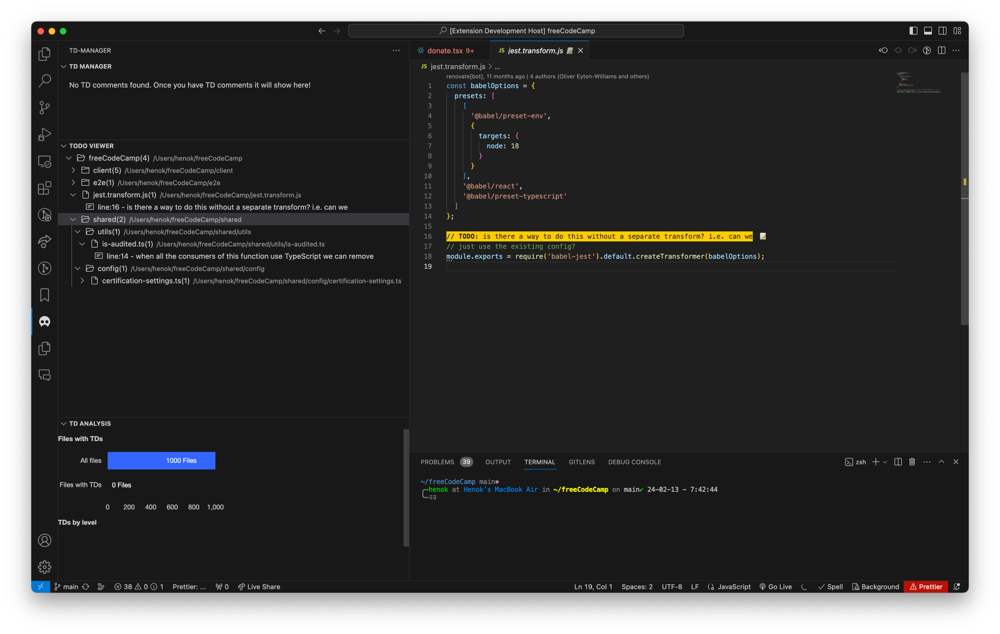

# TD Manager 

**Helps you manage TD(Technical Debt) right from your extension.**
List the `TD` comments in all files of the projects and show them in a list.
You can find the `TD` explorer view in the `Activity Bar` of VSCode. Which will show you the list of all `TD` comments in your project.
You can also set `level` for the `TD` comments. Which will help you to see the `TD` comments in the `Activity Bar` of VSCode.

You can `level` your `TD` comments from 1 to 5. 1 being the lowest and 5 being the highest.
## Features

Add a `//TD:` comment to your code and it will be added to the TD list.

- `[label]` - Label for the TD ( you can use `//TD: [label]` )
- `(level)` - Level (1 - 5) of the TD ( you can use `//TD: [label] (level)` ) - this will show the level of TD
- ` message ` - Message for the TD ( you can use `//TD: [label] (level) - message` ) - this will show the message of TD

###  Example
You can merge similar `TD` issues with a label. If you have the same label in multiple files, you can see them merged in analytics or labels ( in the future - WIP)

- ```// TD: example```
- ```// TD:[example] - this is an example of a TD```
- ```// TD:[example](3) - this is an example of a TD```

When you have a label and a level , TD-manager would help you see the analytics in the future.

## TODO viewer

Now you can view TODO comments on TD-manager!.
We just added a TODO-Viewer section.

## Analytics
Analytics is here now ( the basic version .) 
- You can view how many files have TD comments compared to the overall file

 
## changelog
### 1.0.0
- Add Support for TODO-viewer
- Combine state for TD and TODO viewer ( pretty responsive !)
### 0.0.7
Added analytics for the TDs.
Fixed issues with TD recognition and file decorator
### 0.0.1
Basic version of the extension.
